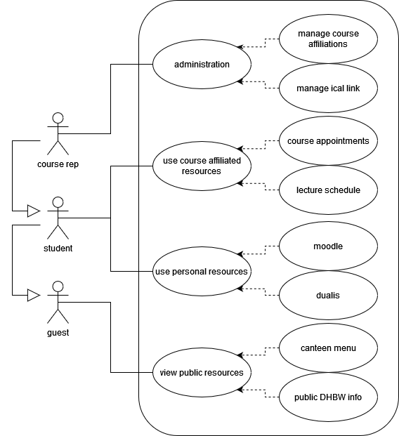
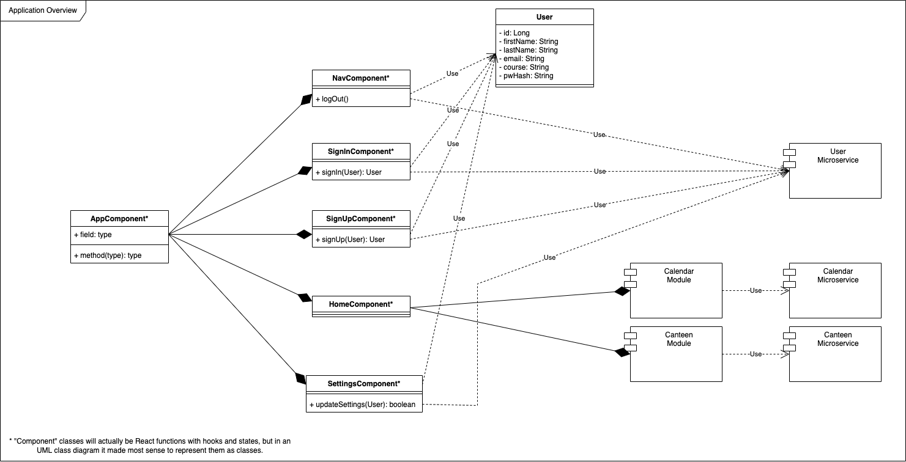
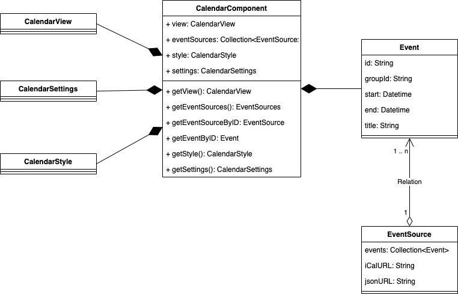
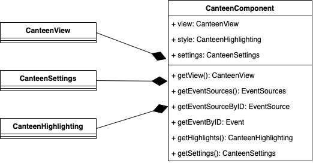
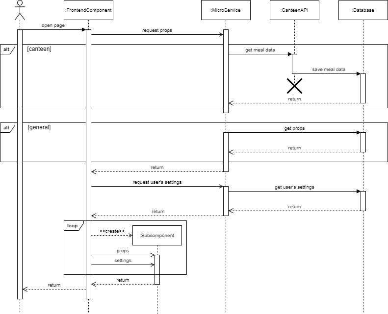
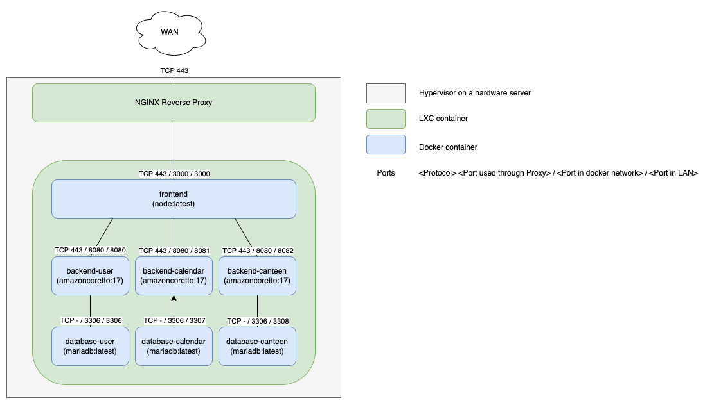
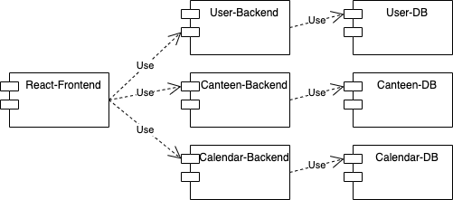

# Software Architecture Document (SAD)

# Introduction
## Purpose
This document provides a comprehensive architectural overview of the system, using a number of different architectural views to depict different aspects of the system. It is intended to capture and convey the significant architectural decisions which have been made on the system.

## Definitions, Acronyms and Abbreviations
Abbrevation | Meaning
----------- | ---------------------------
DHBW        | [Duale Hochschule Baden-Württemberg](https://de.wikipedia.org/wiki/Duale_Hochschule_Baden-W%C3%BCrttemberg_Karlsruhe) (Baden-Württemberg                   Cooperative State University)
SAD         | Software Architecture Document

## Overview
This document gives an overview to the architectural representation, summarizes the goals and constraints and describes the drivers of the architectural approach in several views. It then concludes with size, performance and quality considerations.

# Architectural Representation
The next two sections describe the architectural goals and constraints. Architecturally relevant Use Cases are described by a Use Case diagram and a short explanation
of their impact on the architecture. The following views will also be provided:
+ A logical view provides a view on the systems components and their interactions
+ A process view depicts the system's general behaviour with a sequence diagram
+ An implementation view describes the software layers and the main software
components. A component diagram is used in this view.

UML diagrams are systematically used to represent the different views of the system.

# Architectural Goals and Constraints
[Utility Tree](../architecture_significant_requirements/utility_tree.md)

# Use-Case View 

This section provides a representation of the use cases relevant for the architecture.

The Use cases that are relevant for the architecture have - at this stage - been selected based on the following criteria:

+ Use cases that stress out the variety of services
+ Use cases that stress out the importance of availibility at any time
+ Use cases that show the exchange between backend components and the frontend

The following use cases have therefore been selected:
+ The overall usecase diagram because it displays the variety of services
+ The activity diagram for adding a new appointment to the calendar because it represents both the calendar as an integral service that is expected to be steadily available  and a case of user specific backend communication. A full use case realization document will be added to a later version of the software architecture document.

## Overall Use Case Diagram

## Adding a calendar appointment

# Logical View

This chapter describes the main application modules and their interaction.

## Relevant Class Diagrams

The following diagram provides a general overview of the components that form the DHBW Community Dashboard. It mainly consists of primarily frontend related components (such as NavComponent, HomeComponent) that use primarily backend related components (the microservices).

The more detailed diagrams that are listed below are giving further detail on the nature of those frontend and microservice components.

 

# Process View

This sequence diagram displays the general sequence when the user opens a page. The component (frontend) gets props and user-specific settings via microservice (backend) from the database. For canteen, the frontend component gets the data from an API. Each component contains several subcomponents (e.g. [canteen card](https://dhbwcd-dev.mush-it.com/canteen/default)) to display the provided data/props.

# Deployment View
The following is a description of the hardware and virtualised instances running the execution environment for the application.

This diagram provides a view of hardware and virtualised components involved in this project. Please Note that this is the current development and integration scheme, for a production release splitting up the docker images on a kubernetes cluster with an ingress instead of the nginx reverse proxy is plausible.

# Implementation View

This component diagram displays the architecurally releveant modulation of the software. The project is split into a react frontend and multiple microservices consisting of a java spring-boot rest backend and corresponding mariadb databases. Each component is nested in a seperate docker container, where only the rest backends and the react frontend will be exposed to the user, the databses are only addressable by the backends.

# Performance

An important architectural decision that the system's performance benifits from is to implement caching in several contexts such that the overhead of loading the displayable HTML, JS and CSS is kept as minimal as possible. While a certain size is realistically unavoidable here, concepts like lazy loading, resource injection and minification should be adhered to.

Moreover to ensure both the availability and a proper performance in cases of a slow internet connection a bad-connection-mode will be implemented.

# Quality
[Architecture significant requirements](../architecture_significant_requirements/architecture_decisions_and_design_patterns.md)
