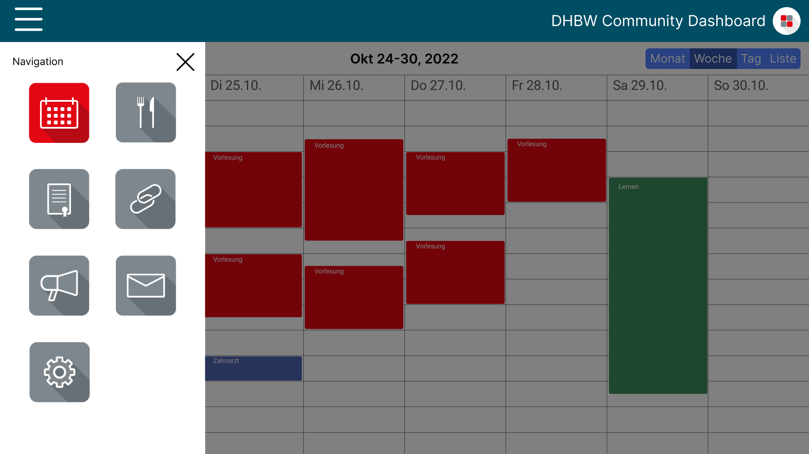
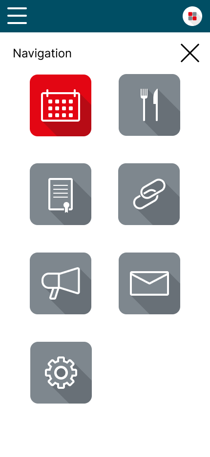
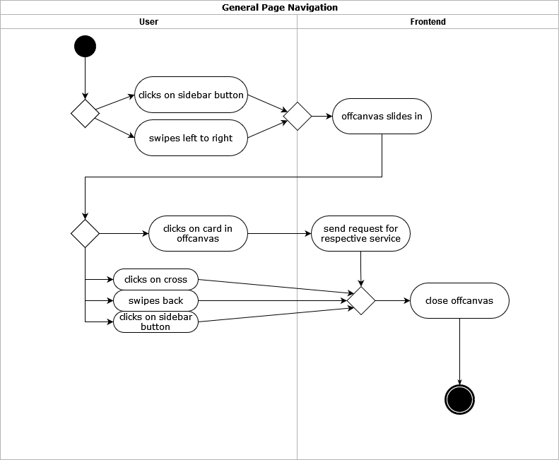
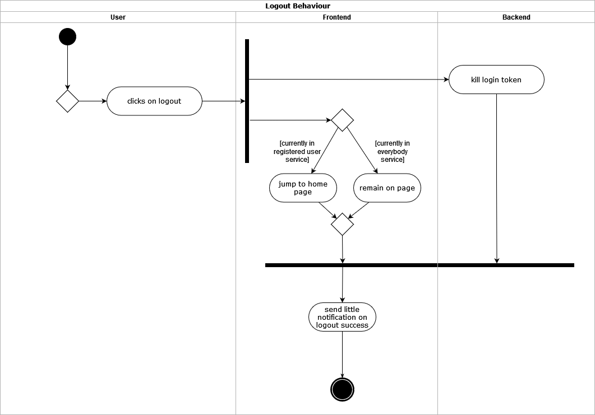
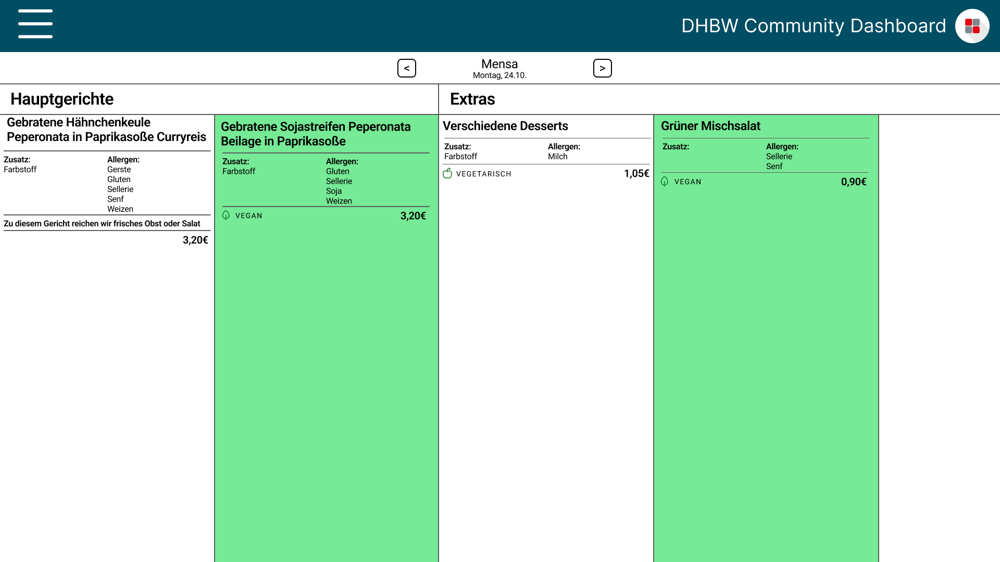
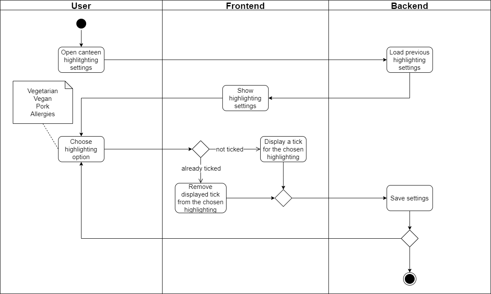
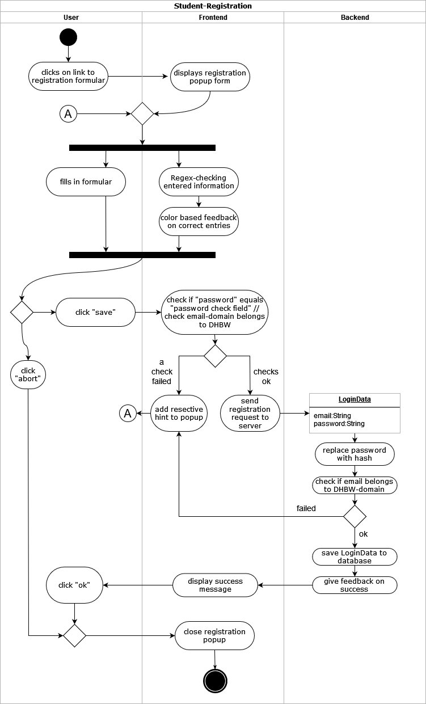

# Software Requirement Specification (SRS)

# Introduction
## Purpose
This SRS lists requirements of a basic design of the DHBW Community Dashboard application in its conceptional entirety. This includes functionalities that provide information for DHBW students' ongoing semester such as canteen menu tables or course schedules and administrative functionalities that allow special users (e.g. course representatives) to administrate some information for their associated user groups.

This SRS does not try to initially and foresightedly define each and every functionality that we want to include to the dashboard, but claims to deliver a set of the most crucial requirements to enable us to design and implement a working and desirable application for the DHBW students.

Since this document contributes to an agile project, it itself is agile in nature. It is growing with the project in detail and extent and stays open towards deeper insight from our experiences with the subject.

## Scope
With the DHBW Community Dashboard we want to offer a tool specified for the organizational needs of DHBW Karlsruhe students. The software intends to enable the students to access their schedule and other course specific events provided and maintained by their elected course representative. It furthermore tries to funnel any information associated with DHBW campus life. 

Hence the scope of this software project is to setup the full stack of a progressive web application that serves the aforementioned purpose. 

## Definitions, Acronyms and Abbreviations
Abbrevation | Meaning
----------- | ---------------------------
DHBW        | [Duale Hochschule Baden-Württemberg](https://de.wikipedia.org/wiki/Duale_Hochschule_Baden-W%C3%BCrttemberg_Karlsruhe) (Baden-Württemberg                   Cooperative State University)

## Overview

# Overall Descripiton
The DHBW Community Dashboard will be designed to **serve the needs of DHBW students** regarding their time management and everyday life at the university. The students often face changes in their schedule and need to communicate such changes via different tools such as Moodle or Discord. To give an example, the Community Dashboard will offer the right calendar based on course affiliation of the specific student and will furthermore notify the users if any changes have been made to their calendar. We also want to give special rights to the course representatives, such that they can administer course specific information for their fellow students.

**Overall, we can divide our project into three aspects:**
- **Personalized tool**: DHBW Community Dashboard gives the students one tool for their time management as a reliable source of truth
- **Superuser modification**: letting specific users administrate information for their fellow students to minimize the individual, organizational efforts
- **Campus matters**: giving access to interesting information regarding the student’s everyday life

Represented by the associated user role these aspects are also depicted in our overall use case diagram.

# Specific Requirements
## Functionality

### General Requirement: Navigation
As a User I want to be able to navigate between pages to always be able to switch between services easily.

### General Requirement: Logout
As a User I want to be able to logout at any time.

### Student requirement: Dashboard Entry Point
As a DHBW student I want to access a dashboard with a pleasent design so that I have an overview to choose which DHBW-CD feature I want to use.

**Derivatives** from this user story:
with respect to [Vanessas research on univerity apps](https://capyclue.atlassian.net/wiki/spaces/KE/pages/11108375/Other+DHBW+Apps)
- I want a little newsfeed (Lörrach Campus App)
- I want a little section for useful links such that I get to know all the offers of the DHBW universe (Anreise und Lageplan, Bibliothek, Service-Zugänge)

- I want to be able to access the canteen section
- I want to be able to access the calendar section
- I want to be able to access the contact section
- I want to be able to access an SOS section

- I want to be able to access (profile) settings

### Student requirement: Calendar
As a DHBW student I want to have my lecture schedule displayed up to date to recent changes to see all my upcoming lectures.

**Derivatives** from this user story:
- I want RAPLA to be synchronized with my calendar on a daily basis // 12 h basis // when I login
- I want to have at least a week and a day view such that upcoming events can be seen comfortably

### Student requirement: Information management
As a student I want to do as little as possible to set up my DHBW Dashboard to reduce organizational effort.

**Derivatives** from this user story:
- I want my course representative to set the corresponding RAPLA-calendar for me and my fellow course members
- I want my course representative to add specific course wide deadlines and events for me and my fellow course members 

### Student requirement: Change notification
As a student I want to be notified if there are upcoming changes in the schedule, such that I won’t be surprised by them.

### Student requirement: Notification mode
As a student I want to be able to set up the mode of notification such that I can be notified about certain information in a certain way (via E-Mail, Push-Notification or not at all)

**Derivatives** from this user story:
- as a default I want to receive an email notification for a reasonable set of change events
- I want to have the possibility to change my notification settings
- I want to be informed (with a direct link) how I can change those settings at the end of a notification

### Student requirement: Individual calendar customization
As a student I want to add information to the calendar, such that I can see conflicts with private appointments. 

### Student requirement: Canteen screen
As a student I want to be able to see which meals of the canteen are offered for the current week.

### Student requirement: Canteen highlighting
As a student I want to configure which meals of the canteen should be highlighted such that I can easily see which meal fulfills my wishes.

### Student requirement: Dualis
As a student I want to be able to have direct access to Dualis to look at my grades.

### Student requirement: Data security
As a student I want to have held my personal data in a secure environment such that it can’t be abused neither by interns nor externs.

**Derivatives** from this user story:
- registration should be via email and secure password
  
  
- registration should demand as little private information as possible (such that there is less data that needs protection)
- any private information or customization data should be prevented from being read by external persons and the amount of personal data that is accessable to internals should be reduced to the very minimum 
- login/logout should be easy nevertheless
- changes on account data should be easy and safe

### Student requirement: Features for everybody
As a student I want certain features to be accessible for people irrespective of them being signed up to the DHBW Community Dashboard such that I can easily share campus information with guests and friends.

### Student requirement: Course affiliation
As a student I want to be able to easily be associated with my DHBW course such that I get access to course specific information.

### Student requirement: Confirm my course representative
As a student I want to be able to confirm my course representative within the application such that there is a way to ensure, that my course is represented by the right person.

### Course representative requirement: Setup calendars
As a course representative I want to be able to setup the course schedule for my fellow students in order to help them organize their schedule.

### Course representative requirement: Collective calendar customization
As a course representative I want to be able to add appointments or events to the calendar inside the community dashboard, such that I am not forced to use DHBW official platforms like RAPLA.

# Non-functional Requirements
## Usability
The application should be usable on any modern client, specifically on desktop / laptop using modern browsers (Chromium, Firefox, Safari), Android and iOS also using the built in browser toolkits.

To achieve a feel as close as possible to a native application, a certain extend of the application should also be [usable offline as soon as the front end has been cached by the browser](https://de.wikipedia.org/wiki/Progressive_Web_App).

To achieve usability on all those scenarios the UI design of the project is chosen as mobile first. That means, that most UI elements and layouts are first and foremost designed with a mobile like screen size as reference. For larger, especially horizontal displays some elements will then be placed horizontally to each other instead of being stacked vertically.

## Reliability
As already mentioned in the usability section, the application should be partially [usable without a consistent internet connection](https://de.wikipedia.org/wiki/Progressive_Web_App).

Furthermore, in a future release ( dev → beta → release) version, high availability and automatic scalability through a cloud first cluster based deployment is being discussed.

## Performance
Performance restraints are mostly applicable to the back end part of the application. As a primary use case scenario of the application will be students checking lecture schedules on the go with their mobile devices with no Wi-Fi connection and possibly low and slow mobile data availability, the data sent from and to the back end should be kept to a minimum in core functionalities of the application.

Regarding the front end this can also mean, that the overhead of loading the displayable HTML, JS and CSS needs to be kept as minimal as possible. While a certain size is realistically unavoidable here, concepts like lazy loading, resource injection and minification should be adhered to.

## Supportability
The status of maintenance of the project after the software engineering lecture, or latest after graduation of the team members is uncertain. Therefore, one discussed option is to hand this project over to other developers or hand it over to the open-source community for further development and maintenance.

To make this feasible the project’s source code and relevant documentation should be structured in a modular way, so that a rather unorganized group of contributors can independently work on various aspects of the application with minimal risk of breaking changes to other parts of the code.

## Architecture Significant Requirements
Some more non-functional attributes or quality attributes are mentioned and explicated in our [utility tree](../architecture_significant_requirements/utility_tree.md).
For that purpose there is also an [architecture decisions and design patterns document](../architecture_significant_requirements/architecture_decisions_and_design_patterns.md).

## General Design Concepts
The Community Dashboard aims to be a intuitive and user friendly tool for which we designed our own specific icons. The navigation should not be nested but clear and direct.

