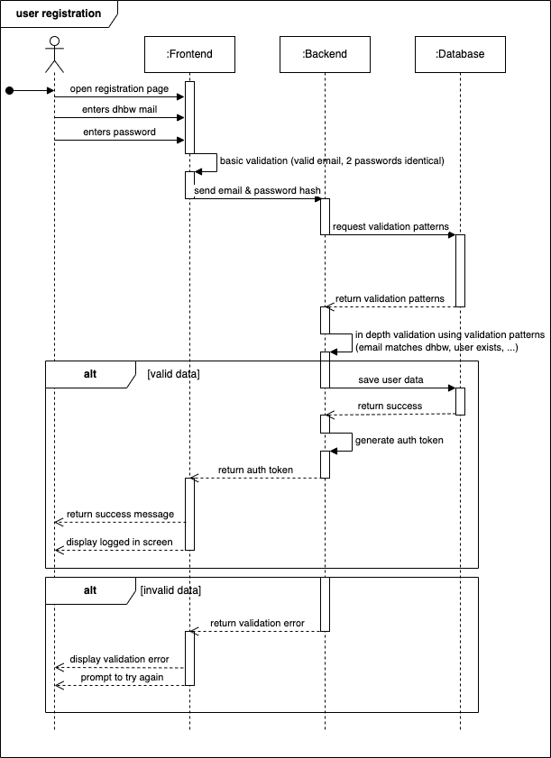

# Use-Case-Realization Specification: Template

# 1. Introduction

## 1.1 Brief Description
This use-case-ralization specification describes the flow of new user registrations using the registration front end page. Main constraints for this are that the new user provides a valid dhbw mail address and comes up with a secure password, which they have to repeat to prevent typos. This will be pattern matched. Passwords will be hashed in the front end and therefore never sent via the internet.

## 1.2 Definitions, Acronyms, and Abbreviations
| Abbreviation | Description                        |
|--------------|------------------------------------|
| DHBW         | Duale Hochschule Baden-Württemberg |

## 1.3 References
- [User Registration Sequence Diagram](../sequence_diagrams/SD2_User_Registration.png)

# 2. Flow of Events

## 2.1 Basic Flow
- A new user navigates to the registration page of the frontend.
- The user is faced with a registration form and enters a (valid dhbw) email address and 2x a new password.
- Front end pattern matching is used to check if the email is a generally valid email address and the password have sufficient complexety as well as if they are identical
- The password is hasehd and the email address and a password hash are sent to the back end.
- The back end retrieves additional validation cirteria and patterns from the database (e.g. the valid dhbw email schemas or if the user already exists, ...)
- The back end applies these validation criteria
- On success the user data is stored to the database for future log in attempts and a session auth token (jwt) is handed back to the front end which redirects the user to the logged-in sections of the application.
- On failure a validation error (with sufficient clarity but adhereing to modern security guidelines) is handed back to the front end and displayed to the user. Eventually they may try again.

### Sequence Diagram
